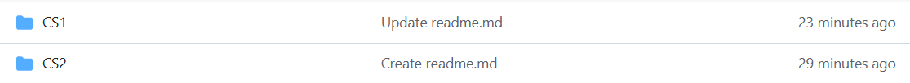
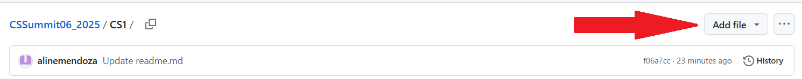
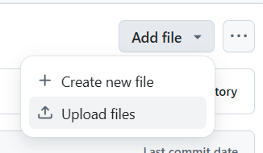
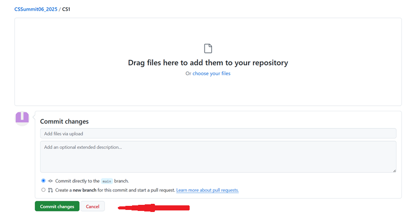

# CSSummit06_2025
## Instruction:
1. No need to download this repository to your vscode. You can **just upload your files** on the appropriate year level folder.
2. To upload:
   a. Click on the approrpriate folder
   
   
   b. Then,click on Add File
   

   c. Choose Upload Files
   

   d. Drage and Drop file/s on the given space then commit your uploaded files:

   
   
3. To move files
  a. Click on the file to be moved.
  b. Up the path to the file 
