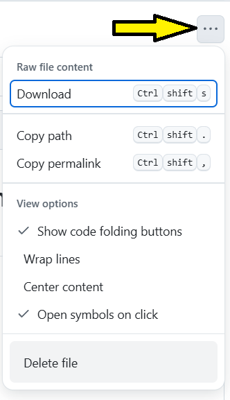

# CSSummit06_2025
## Instruction:
### 1. No need to download this repository to your vscode. You can **just upload your files** on the appropriate year level folder. <ins>*Clone or Fork only when you want to work offline or have your own copy.*</ins>
### 2. To upload:

   a. Click on the approrpriate folder
   
   
   
   b. Then,click on Add File

   

   c. Choose Upload Files

   

   d. Drage and Drop file/s on the given space then commit your uploaded files:

   
   
--------------------------------------------------------------------------------------------------------------------------------------------------   

### 3. To move files or to rename files:

  a. Click on the file to be moved or renamed.
  
  b. Choose the file, then click on the pencil icon (upper right hand)

   
   
  c. The path and filename on the upper left corner will now be editable (backspace until you reached the portion you want to edit), **then click on commit** so that the changes will have an effect. This action can both create a folder for the file or change the folder location of a file. This can also allow you to rename the file.
   
   

--------------------------------------------------------------------------------------------------------------------------------------------------

### 4. To delete a file, click on the file to change then click on Edit

   a. On the right hand corder there are three dots then select Delete File. Make sure to commit the changes.
   
    
